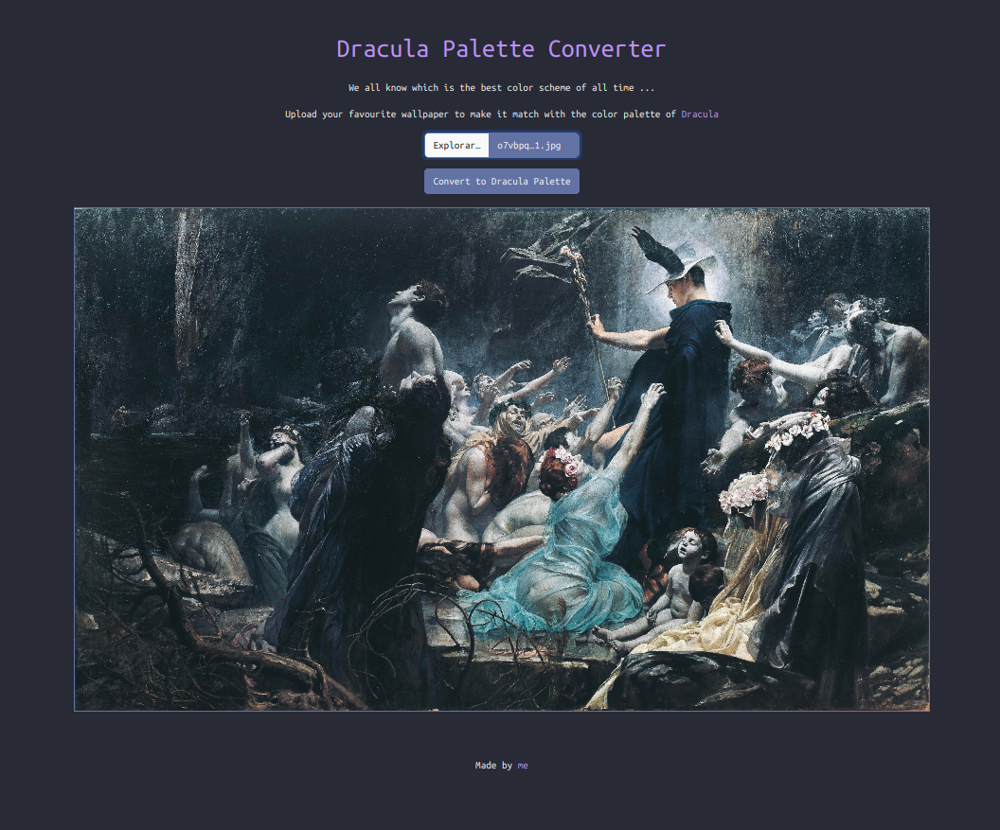
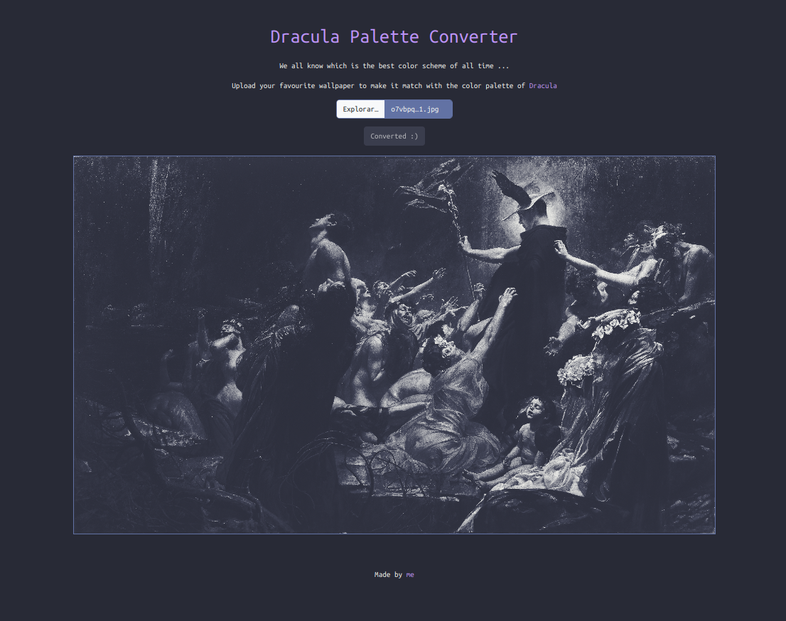

# Dracula Palette Converter
The Dracula Palette Converter is a web application that allows users to upload their favorite images/wallpapers and transform them to match the iconic [Dracula theme](https://draculatheme.com/). 

This tool first converts the image to [Grayscale](https://en.wikipedia.org/wiki/Grayscale) and then colorizes each black, white and mid colored pixel to the respective color of Dracula's palette, making your images consistent with the Dracula theme.

Made for [Hack Club's High Seas](https://github.com/hackclub/high-seas) !!

## Dependencies
- [Dracula theme](https://draculatheme.com/) (well duh...) (seriously, check it out)

## Screenshots
|  |  |
|----------------------------------|----------------------------------|
